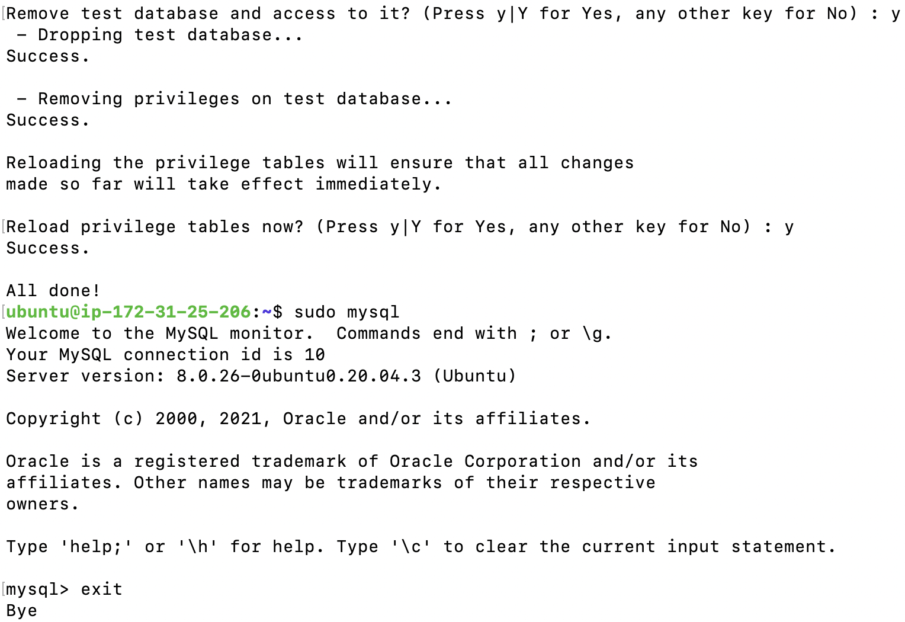
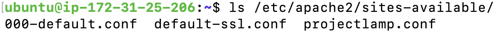

# LAMP STACK Project

Created my AWS account and performed the following tasks:

- Signed into my AWS account and launched an EC2 instance of t2.micro family with Ubuntu Server 20.04 LTS (HVM)
- Saved my private key
- Connected to my EC2 instance through SSH client.

## Installing Apache using Ubuntu’s package manager ‘*apt*’:

`#Update the Ubuntu packages`

`sudo apt update`

`#Installed Apache`

`sudo apt install apache2`

Confirm successful installation

`sudo systemctl status apache2`

Enables port 80 on EC2 instance for inbound connection

Tested Apache on browser

## Installing MYSQL

To be able to store and manage data for your site

`sudo apt install mysql-server`

`sudo mysql_secure_installation` -- validated password plugin

Then exited MYSQL

## Installing PHP

To install these 3 packages at once, run:

`sudo apt install php libapache2-mod-php php-mysql`

Confirm successful installation

To test your setup with a PHP script, I will setup a proper Apache Virtual Host to hold your website’s files and folders.

## Configure an Apache Virtual Host

I started by setting up the domain *`projectlamp`*

Create the directory for projectlamp using `mkdir` command as follows:

`sudo mkdir /var/www/projectlamp`

Next, assign ownership of the directory with your current system user:

`sudo chown -R $USER:$USER /var/www/projectlamp`

Next, create and open a new configuration file in Apache’s `sites-available` directory.

`sudo vi /etc/apache2/sites-available/projectlamp.conf`

update file with text as shown below

`<VirtualHost *:80>`

    ServerName projectlamp
    ServerAlias www.projectlamp 
    ServerAdmin webmaster@localhost
    DocumentRoot /var/www/projectlamp
    ErrorLog ${APACHE_LOG_DIR}/error.log
    CustomLog ${APACHE_LOG_DIR}/access.log combined

`</VirtualHost>`

Saved and closed file following steps below

1. Hit the `esc` button on the keyboard
2. Type `:`
3. Type `wq`. w for `write` and q for `quit`
4. Hit `ENTER` to save the file

Verify new file in `sites-available` directory

`sudo ls /etc/apache2/sites-available`

Next the new virtual, by entering this command

`sudo a2ensite projectlamp`

I disabled the default website that comes installed with Apache. This is required if you’re not using a custom domain name, because in this case Apache’s default configuration would overwrite your virtual host. To disable Apache’s default website use a2dissite command , type:

`sudo a2dissite 000-default`
Screen shot below showing Apache default website disabled

To ensure my configuration file doesn’t contain syntax errors,i entered the command below:

`sudo apache2ctl configtest`

reloaded Apache so these changes take effect:
`sudo systemctl reload apache2`

Created an index.html file in that location so that i can test that the virtual host works as expected, by typing this command

`~$ cd /var/www/projectlamp`
`:/var/www/projectlamp$ touch index.html`
Ran the command below to set my virtual host default web page when my public IP Address URL is launched on my computer web browser.

`sudo echo 'Hello LAMP from hostname' $(curl -s http://169.254.169.254/latest/meta-data/public-hostname) 'with public IP' $(curl -s http://169.254.169.254/latest/meta-data/public-ipv4) > /var/www/projectlamp/index.html`

## ENABLE PHP ON THE WEBSITE

Next, edit the /etc/apache2/mods-enabled/dir.conf file and change the order in which the index.php file is listed within the DirectoryIndex directive:

Entered the command below

`sudo vim /etc/apache2/mods-enabled/dir.conf`

`<IfModule mod_dir.c>`

        #Change this:
        #DirectoryIndex index.html index.cgi index.pl index.php index.xhtml index.htm
        #To this:
        DirectoryIndex index.php index.html index.cgi index.pl index.xhtml index.htm

`</IfModule>`

Saved and closed the file using vim editor.

Reloaded apache2, so change can take effect - 
`sudo systemctl reload apache2`

Created a PHP test script file known as ‘index.php’ to confirm that Apache is able to handle and process requests for PHP files.

`vim /var/www/projectlamp/index.php`

I entered the text below inside the file:

`<?php`

`phpinfo();`

Saved and closed file and refreshed my EC2 public ip address url page

PHP default page screenshot
